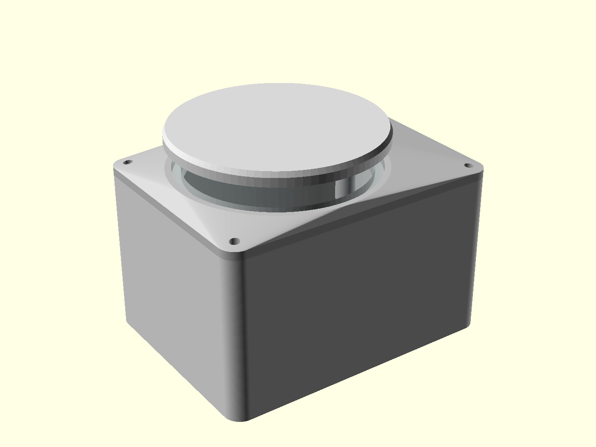
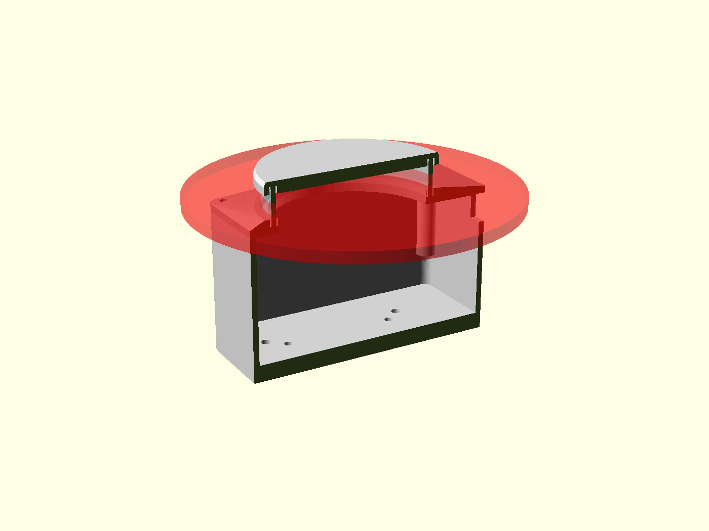

# Sealed Lidar Enclosure with 360° Optical Window
> Parametric OpenSCAD housing for a YDLIDAR X2 — three printed parts and a structural clear tube.
`2026` · `OpenSCAD` · `Parametric CAD` · `Tolerance analysis` · `DFM` · `Python`



## About

A weather-sealed enclosure for a YDLIDAR X2 and its driver board, designed around one hard constraint: **nothing may cross the scan plane.** Any post, screw or rib inside that band becomes a permanent blind sector in the point cloud, so the clear acrylic tube is not a cover — it is the load path between the base and the lid.

**All geometry is measured, not guessed.** The lidar's dimensions come from the vendor's own CAD model, imported and measured, and are isolated in a single locked block of the source.

**Key numbers:** 104.03 × 78.60 mm footprint, 79.5 mm tall. The free optical window spans z = 58.0 … 67.5 mm while the laser needs 59.30 … 64.00 mm, clearing both ends. Radial clearance around the rotating head inside the tube is 2.75 mm, and the lid underside sits 2.18 mm above the head.

**Tolerance study.** Extruded acrylic at Ø70 carries +0.35/−1.05 mm on outside diameter and ±20 % on wall thickness — more variation than any sane press fit allows. So the tube groove is deliberately loose at 0.6 mm per side and a silicone bead takes up the slack, which also seals against dust and decouples the tube from the head's vibration. That makes diameter error forgiving, but wall error is not: wall thickness eats head clearance one-for-one.

**Verification tooling.** I wrote a post-export checker that reports connected components with signed volume and bounding box per part. This caught a real failure: a subtracted chamfer cone sized wider than the lid was *severing* it into a body plus a floating ring. The file was manifold, plausibly sized, and invisible in the slicer's default view — only the component count exposed it.

## Figures



## Contents

```
README.md
README_ceiling_mount.md
README_shadow_front_mount.md
README_v2.md
ceiling_mount.scad
docs/
img/
n2_petg_shadow_mount.ini
n2_petg_shadow_mount_fast.ini
n2_pla_lidarbox.ini
n2_pla_lidarbox_v2.ini
plate_collar_lid.scad
shadow_front_mount.scad
stl/
stl_mount/
stl_v2/
tools/
ydlidar_x2_box.scad
ydlidar_x2_box_v2.scad
```

## Notes

The vendor's YDLIDAR X2 reference CAD is not redistributed here; the enclosure is parametric OpenSCAD and carries its own measured sensor dimensions.

Not included in this repository: 1 mesh/binary over 20 MB file(s), 1 third-party code file(s) - build caches, generated toolpaths and oversized binaries are kept out on purpose. The source they are generated from is here.

## Third-party work used here

Everything in this repository is my own work. It builds on the following, which are **not** mine and are used under their own licences:

- **OpenSCAD** by OpenSCAD project — <https://openscad.org>
- **YDLIDAR X2 reference dimensions** by EAI / YDLIDAR — <https://www.ydlidar.com>

Third-party source that sits in my local working folder is deliberately **not** republished here; clone it from upstream instead.

## Author

Lassaad Mahmoudi — <assaadmahmoudi0@gmail.com>  
https://linkedin.com/in/mahmoudi-assaad
